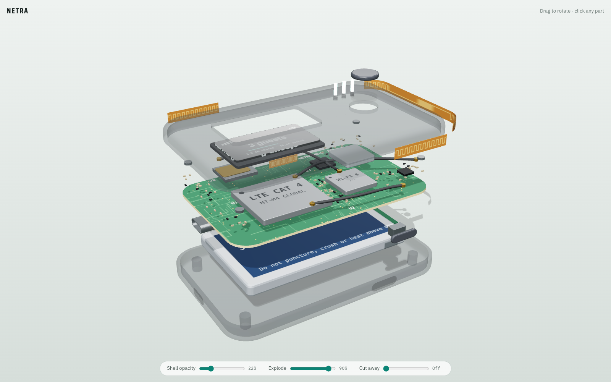

# Netra

Netra is a programmable paid hotspot for humans and AI agents. A host shares internet through a real Wi-Fi hotspot, traffic stays blocked until payment is verified, and every session produces a portable receipt with a Solana payment proof plus a CID-backed audit artifact for long-term reputation and service history.

[](https://pieismath.github.io/netra-viewer/)

**[Open the interactive 3D teardown](https://pieismath.github.io/netra-viewer/)**: rotate the hotspot, fade the shell, explode or cut through it, and click any part to see what it does. Source: [`hardware/netra-teardown.html`](hardware/netra-teardown.html).

## What It Does

- Human buyers join a hotspot and are forced through a captive portal before internet access opens.
- Agentic buyers hit an x402-style HTTP endpoint, receive `402 Payment Required`, pay on Solana devnet, then retry with a transaction signature to unlock access programmatically.
- Hosts get a dashboard with live sessions, tx hashes, refund outcomes, and recent CID-backed artifacts.
- Session logs, hotspot profile snapshots, and reputation rollups are persisted as tamper-resistant artifacts and can optionally be uploaded through Filecoin Synapse when credentials are configured.

## Who It Is For

- Hotspot hosts who want provable pay-per-session internet access.
- Judges who want one coherent demo showing real gating, real Solana payment verification, and visible proof artifacts.
- AI agents or scripted clients that need to buy access without a human checkout flow.

## Architecture

```text
Buyer device / agent
  |
  |  Human path: joins Wi-Fi, traffic blocked
  |  Agent path: POST /x402/sessions/purchase
  v
Captive portal + pf firewall           x402 API (HTTP 402)
  |                                         |
  | Solana Pay deep link                    | Solana devnet payment challenge
  | payment-status polling                  | retry with Payment-Signature
  v                                         v
Proxy control plane (/sessions, /dashboard, /x402/*)
  |
  | unified session ledger
  | tx verification
  | CID artifact generation
  v
Host dashboard + artifact store
  |
  | optional Synapse upload when configured
  v
Filecoin Onchain Cloud / Synapse
```

More detail lives in [ARCHITECTURE.md](/Users/jasonfang/Desktop/hotspot-dex/ARCHITECTURE.md).

## Why Solana x402 Matters

- The hotspot is not merely "paid with crypto."
- The agent flow is explicitly HTTP-native:
  - request protected resource
  - receive `402 Payment Required`
  - pay on Solana devnet
  - retry with proof
  - server verifies and unlocks or extends access
- Human buyers still get the captive-portal UX judges expect for a real hotspot.
- Agent buyers get a real programmatic payment rail for the same hotspot product.

## Why Filecoin Matters

- Session receipts and closeout logs become CID-backed artifacts instead of ephemeral UI rows.
- Hosts build portable reputation from completed sessions, refunds, disconnect rate, and service history.
- The dashboard surfaces these artifacts directly so judges can see the proof layer.
- When `FILECOIN_PRIVATE_KEY` is configured, the backend attempts Synapse uploads for these same artifacts.

## Why Blockchain Is Essential

- Solana is the unlock condition for network access, not a decorative checkout layer.
- The Solana tx hash is the proof that a hotspot session was actually paid for.
- CID-backed artifacts make the operational record portable, content-addressed, and hard to tamper with.
- Reputation becomes exportable across hotspot operators instead of trapped in one server database.

## Repository Layout

```text
frontend/         Next.js buyer + host + dashboard UI
proxy-server/     traffic gate, session ledger, x402 API, Solana verification, artifact storage
captive-portal/   pf-driven captive portal, DNS interception, Solana Pay mobile checkout
contracts/        legacy Solidity escrow prototype (not part of the primary demo path)
start.sh          local orchestration for the Solana-first stack
```

## Setup

### Prerequisites

- Node.js 18+
- npm 9+
- macOS if you want the full captive-portal + pf demo
- A Solana devnet wallet for the host
- Optional: Filecoin Synapse credentials for warm-storage uploads

### Install

```bash
cd proxy-server && npm install
cd ../frontend && npm install
cd ../captive-portal && npm install
```

### Environment

Copy [`.env.example`](/Users/jasonfang/Desktop/hotspot-dex/.env.example) values into your shell or your own env management.

Most important variables:

```bash
export SOLANA_WALLET=<host devnet wallet>
export SOLANA_RPC=https://api.devnet.solana.com
export RATE_PER_MIN=0.001
```

Optional Filecoin Synapse variables:

```bash
export FILECOIN_PRIVATE_KEY=<calibration key>
export FILECOIN_NETWORK=calibration
export FILECOIN_RPC_URL=https://api.calibration.node.glif.io/rpc/v1
```

### Run

```bash
./start.sh
```

Optional:

```bash
./start.sh --no-captive
```

This keeps the UI + control plane running without pf/captive-portal setup.

## Local Demo Flow

### Human captive-portal flow

1. Enable Internet Sharing on your Mac.
2. Run `sudo ./captive-portal/setup-pf.sh` once.
3. Start the stack with `./start.sh`.
4. Join the `⚡Netra-...` hotspot from a phone.
5. Observe that normal browsing is blocked.
6. Pay in the captive portal using Phantom on Solana devnet.
7. Observe that internet access opens and the dashboard shows the tx hash plus a CID-backed receipt.

### Agent x402 flow

1. Start the stack.
2. Run:

```bash
cd proxy-server
SOLANA_SECRET_KEY='[...devnet secret key json...]' node scripts/x402-demo.js
```

3. The script:
   - requests `/x402/sessions/purchase`
   - receives `402 Payment Required`
   - pays on Solana devnet
   - retries with `Payment-Signature`
   - gets back an active session

## API Highlights

- `GET /health`
- `GET /dashboard`
- `GET /sessions`
- `POST /sessions`
- `DELETE /sessions/:ip`
- `POST /x402/sessions/purchase`
- `POST /x402/sessions/:sessionId/extend`
- `GET /x402/spec`

## Tests

Run the highest-value backend tests with:

```bash
cd proxy-server
npm test
```

These cover:

- CID artifact creation
- session ledger behavior
- x402 challenge generation
- purchase fulfillment path

## Known Limitations

- Synapse uploads are env-gated because they require funded Filecoin credentials; without them the app still produces deterministic local CIDs.
- The captive portal is macOS + pf oriented for local demo realism.
- Agent flow assumes the client is buying access for an IP already on the hotspot or otherwise known to the control plane.
- The legacy Solidity escrow code remains in `contracts/` as historical prototype code and is not part of the focused hackathon submission.

## Primary Demo Files

- [proxy-server/server.js](/Users/jasonfang/Desktop/hotspot-dex/proxy-server/server.js)
- [proxy-server/lib/hotspot-service.js](/Users/jasonfang/Desktop/hotspot-dex/proxy-server/lib/hotspot-service.js)
- [proxy-server/scripts/x402-demo.js](/Users/jasonfang/Desktop/hotspot-dex/proxy-server/scripts/x402-demo.js)
- [captive-portal/server.js](/Users/jasonfang/Desktop/hotspot-dex/captive-portal/server.js)
- [frontend/app/dashboard/page.tsx](/Users/jasonfang/Desktop/hotspot-dex/frontend/app/dashboard/page.tsx)
- [frontend/components/ConnectModal.tsx](/Users/jasonfang/Desktop/hotspot-dex/frontend/components/ConnectModal.tsx)
